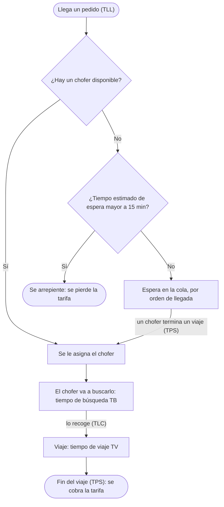
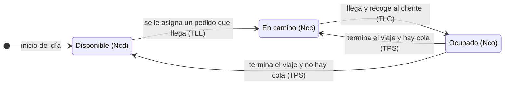

# Modelo de simulación: cantidad óptima de choferes en una plataforma MaaS

**Lyft · zona de Boston · simulación evento a evento**

- **Versión:** 2.3
- **Fecha:** 2 de octubre de 2026
- **Estado:** aprobado para la primera iteración
- **Materia:** Simulación · UTN FRBA · Trabajo Práctico Nº 5
- **Autores:** _completar integrantes del grupo_
- **Reemplaza a:** v2.2 (los cambios están en la sección 13)

---

## Cómo leer este documento

Este documento explica **qué** se modela y **por qué** se tomó cada decisión. **Cómo** se programa está en la especificación técnica ([`sdd.md`](sdd.md)), que se deriva de este documento y no repite sus justificaciones.

| Para… | Ver |
|---|---|
| Entender el modelo en cinco minutos | Resumen |
| Entender cómo funciona el sistema | Secciones 1, 2 y 3 |
| Revisar por qué se decidió cada cosa | Sección 11 (registro de decisiones) |
| Encontrar lo que pide la cátedra (variables, TEI, TEF, escenarios) | Secciones 5, 7 y 10 |
| Programar el simulador | Secciones 4 a 9, y después `sdd.md` |
| Completar las FDP definitivas (notebook) | Secciones 4.3 y 4.5, y el formato de entrega en la sección 5.6 del SDD |
| Saber qué queda para después de la entrega | Sección 12.3 (segunda iteración) |

**Convenciones**

- **Unidades:** tiempo en minutos, distancia en millas, dinero en USD.
- **Identificadores:** D-xx son decisiones (sección 11), S-xx supuestos (sección 3) y P-xx pendientes (sección 12).
- **Valores numéricos:** están calculados con las FDP provisorias (mock). Cambian cuando se carguen las FDP ajustadas en el TP4; las reglas para calcularlos no cambian.
- **Iteraciones:** el trabajo se entrega en dos tandas (D-16). La **primera iteración** tiene lo necesario para la entrega. La **segunda iteración** reúne mejoras que no cambian la decisión sobre la flota; se hace una vez que la simulación funcione, o antes si a alguien del grupo le sobra tiempo. Lo que es de la segunda iteración está marcado así en el texto, y la lista completa está en la sección 12.3.

**Contenido**

0. Resumen
1. Contexto y objetivo
2. Descripción del sistema
3. Supuestos del modelo
4. Datos de entrada y FDPs
5. Clasificación de variables
6. Métricas de resultado
7. Tabla de Eventos Independientes y Tabla de Eventos Futuros
8. Descripción de los eventos
9. Diseño experimental
10. Criterio de decisión y escenarios
11. Registro de decisiones
12. Pendientes y limitaciones
13. Cambios
14. Glosario

---

## 0. Resumen

- **Sistema:** pedidos de viaje de Lyft en una zona de Boston, atendidos por una flota de NCH choferes conectados.
- **Pregunta:** ¿cuál es la menor flota que da un servicio aceptable, y cómo cambia si la demanda sube o baja un 30 %?
- **Servicio aceptable:** espera total media (desde el pedido hasta que llega el auto) de 10 minutos o menos, y no más de un 5 % de clientes que abandonan (D-03).
- **Dinámica:** tres eventos. Llega un pedido (TLL), el chofer llega a buscar al cliente (TLC) y termina el viaje (TPS). Si no hay choferes libres y la app estima más de 15 minutos de espera, el cliente se arrepiente (D-02).
- **Experimento:** días de 24 horas (1440 min), 30 réplicas por configuración, tres niveles de demanda y un rango de flotas (de 4 a 17 choferes con las FDP provisorias).
- **Escenarios:** peor (flota por debajo de la demanda media), actual (flota dimensionada por el promedio) y mejor (la menor flota que cumple el criterio). Con las FDP provisorias, peor = 8 y actual = 9; el mejor sale de la simulación.
- **Forma de la respuesta:** "conviene pasar de 9 a N choferes; si la demanda sube un 30 %, harían falta M".
- **Entrega en dos iteraciones (D-16):** la primera tiene todo lo necesario para una conclusión correcta y defendible. La segunda reúne mejoras que no cambian esa conclusión; la principal es que la tarifa dependa de la distancia (sección 12.3).

---

## 1. Contexto y objetivo

### 1.1 Problema

Una plataforma de movilidad como Lyft tiene que decidir cuántos choferes necesita conectados en una zona. La decisión tiene dos costos que se mueven en sentidos opuestos:

- **Con pocos choferes**, los clientes esperan mucho. Algunos cancelan y toman otro medio de transporte, y la plataforma pierde esa tarifa.
- **Con muchos choferes**, los clientes casi no esperan, pero los choferes pasan buena parte del día sin viajes. Ganan poco y tienden a dejar la plataforma.

El objetivo es encontrar el punto de equilibrio: la menor flota que mantiene el servicio dentro de un nivel aceptable.

### 1.2 Preguntas que responde la simulación

1. Con la demanda actual, ¿cuál es la menor cantidad de choferes conectados (NCH) que cumple el criterio de servicio?
2. ¿Qué le pasa a la flota actual si la demanda aumenta o disminuye un 30 %? ¿Cuántos choferes harían falta en cada caso?

### 1.3 Por qué hace falta simular

La cuenta intuitiva es: "llegan 0,4 pedidos por minuto y cada pedido ocupa a un chofer unos 20 minutos, así que con 8 choferes alcanza". Esa cuenta usa solo promedios. En la realidad los pedidos llegan en ráfagas y algunos viajes son mucho más largos que otros, así que con esa flota se forma cola en los momentos de mayor carga. Medir cuántos choferes más hacen falta para absorber esa variabilidad es justamente lo que aporta la simulación.

Además, el sistema combina elementos que las fórmulas cerradas de teoría de colas no cubren juntas: un servicio en dos etapas (búsqueda y viaje), clientes que se arrepienten según el tiempo de espera que les muestra la app y un horizonte finito de un día.

### 1.4 Alcance

**Incluido:** una plataforma, una zona, demanda constante durante el día, arrepentimiento al momento de pedir y tarifa de cada viaje sorteada de su FDP. En la primera iteración la tarifa no depende de la distancia; en la segunda, sí (D-14).

**Fuera de alcance:** tarifa dinámica, ubicación geográfica de choferes y clientes, perfil horario de la demanda, turnos y desconexiones de choferes, cancelaciones durante la espera, viajes compartidos y competencia con otras plataformas.

### 1.5 Relación con la consigna del TP5

| La consigna pide | Dónde está |
|---|---|
| Clasificación de variables | Sección 5 |
| Tabla de Eventos Independientes (TEI) | Sección 7.1 |
| Tabla de Eventos Futuros (TEF) | Sección 7.2 |
| FDPs obtenidas en el TP4 | Sección 4 (ver P-01: la demanda es un supuesto) |
| Al menos tres escenarios: actual, mejor y peor | Sección 10.2 |
| Conclusión sobre el escenario más conveniente | Sección 10.4 |
| Desarrollo computacional | [`sdd.md`](sdd.md) y la carpeta `src/` |
| Documento con el formato de la cátedra | Pendiente: se arma al final, con el formato de paper de [`enunciado/formato_papers_estudiantes.doc`](enunciado/formato_papers_estudiantes.doc) |
| Exposición oral de hasta 10 minutos | Pendiente |
| Material de trabajo en un repositorio | Este repositorio |

---

## 2. Descripción del sistema

### 2.1 Recorrido de un pedido

1. Un cliente pide un viaje.
2. Si hay un chofer disponible, la plataforma se lo asigna en el acto.
3. Si no hay, la app le muestra un tiempo estimado de espera. Si supera los 15 minutos, el cliente se arrepiente y se va, y la plataforma pierde la tarifa. Si no, el cliente queda esperando en una cola por orden de llegada.
4. Cuando un chofer termina un viaje y hay clientes esperando, toma al primero de la cola.
5. El chofer asignado va a buscar al cliente (tiempo de búsqueda), lo recoge y hace el viaje (tiempo de viaje).
6. Al terminar el viaje, el cliente paga la tarifa y el chofer queda disponible, o toma al siguiente cliente de la cola si hay alguno.

### 2.2 Estados de un chofer

Cada chofer está, en todo momento, en uno y solo uno de tres estados:

| Estado | Significado | Variable que los cuenta |
|---|---|---|
| Disponible | Conectado y sin pedido asignado | Ncd |
| En camino | Yendo a buscar a un cliente que se le asignó | Ncc |
| Ocupado | Con el cliente a bordo, haciendo el viaje | Nco |

Como cada chofer está en exactamente un estado, siempre se cumple que **Ncd + Ncc + Nco = NCH**.

### 2.3 Ejemplo de un pedido en el tiempo

| Minuto | Qué pasa | Evento |
|---|---|---|
| 100 | El cliente pide un viaje. No hay choferes disponibles, pero el tiempo estimado es menor a 15 minutos, así que entra a la cola. | TLL |
| 103 | Un chofer termina otro viaje y se le asigna este cliente. | TPS de ese chofer |
| 108 | El chofer llega y recoge al cliente. | TLC |
| 123 | Termina el viaje y el cliente paga. | TPS |

En este ejemplo:

- La **espera en cola** fue de 3 minutos (de 100 a 103). Es la parte de la espera que depende de cuántos choferes haya.
- El **tiempo de búsqueda** fue de 5 minutos (de 103 a 108). No depende de la flota (supuesto S-05).
- La **espera total**, la que percibe el cliente, fue de 8 minutos (de 100 a 108).
- El chofer quedó comprometido 20 minutos con este cliente (de 103 a 123): búsqueda más viaje. A esa suma se la llama **tiempo de servicio** (S).

---

## 3. Supuestos del modelo

Todo modelo simplifica la realidad. Esta tabla deja explícito qué se simplificó, por qué, y cómo puede afectar a los resultados.

| ID | Supuesto | Por qué | Efecto en los resultados |
|---|---|---|---|
| S-01 | Una sola plataforma (Lyft) y una zona chica de Boston. | Delimita el sistema. Las distancias del dataset vienen de rutas entre unos 12 barrios. | Los resultados valen para la zona, no para toda la ciudad. |
| S-02 | NCH es la cantidad de choferes **conectados al mismo tiempo**, y se mantiene constante todo el día. | Es la variable que la plataforma gestiona, por ejemplo con incentivos. Los turnos quedan fuera de alcance. | NCH no es la cantidad de choferes registrados: sostener 10 conectados todo el día requiere más personas rotando. |
| S-03 | Demanda homogénea: un pedido cada 2,5 minutos en promedio durante todo el día. Los pedidos llegan de a uno y los intervalos son exponenciales (proceso de Poisson). | No hay datos del perfil horario de Boston (D-01). | No hay horas pico. El nivel de demanda +30 % se puede leer como una aproximación a una hora pico. |
| S-04 | Cola única por orden de llegada. Si hay varios choferes disponibles, el pedido se asigna al de menor número. | Los choferes son idénticos, así que la elección no cambia ninguna métrica agregada. Se elige la regla más simple y determinista. | Las métricas por chofer individual (viajes de cada uno) no son significativas; solo las agregadas. |
| S-05 | El tiempo de búsqueda no depende de cuántos choferes haya libres ni de NCH. | No se modela la geografía. | En la realidad, con pocos choferes libres el más cercano suele estar más lejos. El modelo subestima la espera con flotas chicas, así que el NCH recomendado es una **cota inferior**. |
| S-06 | Tiempo de viaje = distancia ÷ velocidad media de 13 mi/h (≈ 21 km/h), más una demora aleatoria por tráfico. | El dataset no tiene duraciones de viaje. | Los tiempos de viaje dependen de esa velocidad, que en la primera iteración es un supuesto sin validar con datos (P-07, segunda iteración). |
| S-07 | El cliente solo puede arrepentirse al momento de pedir, según el tiempo estimado que muestra la app. Una vez en la cola, no abandona. El chofer no cancela. | Ver D-02. | Si en la realidad se cancelan pedidos mientras se espera, el abandono real es mayor que el simulado. |
| S-08 | Todo cliente que recibe un chofer completa el viaje y paga la tarifa al terminar. | Simplificación. | — |
| S-09 | Al terminar un viaje, el chofer queda disponible en el acto, sin reposicionarse. El traslado hacia el próximo cliente está incluido en el tiempo de búsqueda. | No se modela la geografía. | — |
| S-10 | Sin tarifa dinámica: la tarifa se modela con los precios del producto estándar sin recargo. | Se modela el producto estándar sin recargo (D-14). | La recaudación no refleja los precios más altos de los momentos de alta demanda. |
| S-11 | El día empieza vacío: sin cola y con todos los choferes disponibles. | Condición inicial simple. Con demanda constante, el efecto del arranque dura poco frente a 1440 minutos. | Leve subestimación de la espera en los primeros minutos del día. |
| S-12 | Los atributos de cada cliente son independientes entre sí, salvo el tiempo de viaje, que depende de la distancia. La tarifa es independiente en la primera iteración (S-14) y depende de la distancia en la segunda (D-14). | No hay datos que indiquen otra relación. | — |
| S-13 | **Solo en la segunda iteración**, cuando la tarifa depende de la distancia (D-14): la variación de la tarifa alrededor de la recta de la regresión es la misma para viajes cortos y largos, con una sola FDP para el residuo. | Simplificación: alcanza para la recaudación, que es informativa. | La recaudación media no cambia. La dispersión de la tarifa de cada viaje queda aproximada: probablemente subestimada en los viajes largos y sobreestimada en los cortos. |
| S-14 | **En la primera iteración**, la tarifa de cada viaje es independiente de su distancia: se sortea de una FDP ajustada a los precios (D-14). | Plazo de entrega: la tarifa según la distancia queda para la segunda iteración (sección 12.3). | La recaudación media no cambia: la tarifa no interviene en ningún evento ni en el criterio, y ningún cliente decide según el largo de su viaje. Cada viaje individual puede tener una tarifa poco coherente con su largo (un viaje corto puede salir caro), y la variabilidad de la recaudación entre días puede diferir levemente. |

---

## 4. Datos de entrada y FDPs

### 4.1 Qué datos hay y para qué sirven

El dataset del TP4 (Kaggle, Uber y Lyft en Boston, noviembre y diciembre de 2018) **no registra viajes, sino cotizaciones**: un script consultó las APIs de Uber y Lyft cada pocos minutos, para rutas fijas entre unos 12 barrios y para cada producto. Lo confirman tres evidencias:

- Hasta 203 filas comparten el mismo timestamp: son un lote de consultas, no clientes simultáneos.
- Varios días tienen casi exactamente 20.000 filas, incluidos sábado, domingo y lunes. La demanda real no es tan constante.
- Hay días sin datos o casi vacíos: el script estuvo apagado.

Por eso el dataset sirve para algunas variables y no para otras. El detalle está en [`fdps-decisiones.pdf`](fdps-decisiones.pdf). Ese documento propone modelar la tarifa con una regresión sobre la distancia: esa propuesta quedó para la segunda iteración (D-14).

| Variable | ¿Sale del dataset? | Motivo |
|---|---|---|
| Intervalo entre pedidos | No | La diferencia entre timestamps mide el ritmo del script, no la demanda (D-01). |
| Distancia | Sí | Columna `distance`, deduplicada. |
| Tarifa | Sí | Columna `price`, solo el producto estándar y sin recargo dinámico. En la primera iteración se le ajusta una FDP propia, sin relación con la distancia; en la segunda, se modela en función de la distancia (D-14). |
| Tiempo de viaje | No | No existe en el dataset; se calcula a partir de la distancia. |
| Tiempo de búsqueda | No | No existe en el dataset; es un supuesto. |

### 4.2 Fichas de las FDPs

| Símbolo | Variable | Origen | Distribución definitiva | FDP provisoria (mock) | Estado |
|---|---|---|---|---|---|
| IA | Intervalo entre pedidos (min) | Supuesto (D-01) | Exponencial, media 2,5 (niveles de demanda en 9.3) | La misma | Definitiva |
| TB | Tiempo de búsqueda (min) | Supuesto | Gamma con media 5 y desvío 1,5: forma ≈ 11,11 y escala 0,45. No se ajusta a datos | La misma | Definitiva (P-06 resuelto) |
| D | Distancia (mi) | Dataset: Lyft, deduplicado por timestamp + origen + destino | Lognormal, gamma o Weibull, elegida por BIC y gráfico QQ. La distribución empírica queda para la segunda iteración | Lognormal (μ = 1, σ = 0,5), media 3,08 | Pendiente (P-03): plan en 4.5.1 |
| DEM | Demora por tráfico (min) | Supuesto | Exponencial con media 0,8 | La misma | Definitiva (P-05 resuelto) |
| TV | Tiempo de viaje (min) | Calculado | TV = D × 60 / v + DEM, con v = 13 mi/h | La misma | Velocidad sin validar: segunda iteración (P-07) |
| TAR | Tarifa (USD) | Dataset: producto `Lyft`, sin recargo dinámico | **Primera iteración:** FDP ajustada a los precios, sin relación con D (S-14). **Segunda iteración:** base + k × D + residuo, con base y k por regresión lineal simple y el residuo con su propia FDP; si queda por debajo de la tarifa mínima, se vuelve a sortear el residuo (D-14, D-15) | Uniforme entre 5 y 25, independiente de D | Pendiente (P-04): plan en 4.5.2. Segunda iteración (P-14): plan en 4.5.6 |

**Parámetros de la búsqueda y de la demora.** Con media m = 5 y desvío s = 1,5, la gamma tiene forma = (m / s)² ≈ 11,11 y escala = s² / m = 0,45; en scipy es `gamma` con `a` = forma y `scale` = escala. La demora es `expon` con `scale` = 0,8. Las dos se usan igual en la V1 y en la V2 del simulador. En versiones anteriores eran normales recortadas (`max(1, N(5; 1,5))` y `max(0, N(0; 2))`): se descartaron porque el recorte deja picos artificiales en el piso (sección 4.3).

### 4.3 Reglas para el ajuste de las FDPs

- Solo familias con soporte positivo para distancia, búsqueda y demora. Nunca corregir valores negativos con un recorte (`np.clip`): crea un pico falso en el mínimo.
- Para la tarifa, familias con soporte positivo o con una probabilidad de valores negativos despreciable: menor que 10⁻⁹, que se comprueba con `cdf(0)` de scipy. Por ejemplo, la `johnsonsb` que ajustó el notebook admite valores desde −0,026 USD, pero con probabilidad del orden de 10⁻¹⁸: se acepta.
- Las variables con signo, como el residuo de la tarifa en la segunda iteración, usan familias que admiten valores negativos (normal, t de Student, Laplace, logística).
- No ajustar FDP a datos generados por nosotros mismos, como duraciones calculadas o tiempos de búsqueda simulados: el ajuste solo devuelve lo que se puso.
- Elegir la distribución por BIC y gráfico QQ, no por el p-valor de Kolmogorov-Smirnov: con decenas de miles de datos, ese test rechaza casi cualquier distribución.
- Leer los parámetros desde el código del notebook (por ejemplo, `get_best()` de Fitter), no copiarlos a mano.
- Fijar la semilla al principio del notebook y correrlo de arriba hacia abajo.
- Revisar las muestras generadas: ningún valor negativo ni absurdo.

### 4.4 Valores de referencia: tiempo medio de servicio

Varios cálculos del modelo (el arrepentimiento y la flota actual) usan el **tiempo medio de servicio** E[S]: cuánto tiempo, en promedio, queda comprometido un chofer con un cliente desde que se lo asignan hasta que termina el viaje.

$$
E[S] = E[TB] + E[TV] = E[TB] + \frac{60 \cdot E[D]}{v} + E[DEM]
$$

Por linealidad de la esperanza, E[S] se calcula **de forma exacta** a partir de las medias de las FDP, sin necesidad de simular. Se calcula una sola vez, antes de las corridas, y se usa sin redondear.

| Valor | Con las FDP provisorias |
|---|---|
| E[TB] | 5,00 min |
| E[D] | 3,08 mi |
| E[TV] = 60 × E[D] / 13 + E[DEM] | 14,22 + 0,80 = 15,02 min |
| **E[S]** | **20,02 min** |

> **Sensibilidad a tener en cuenta.** Con las FDP provisorias, la carga del nivel base (sección 9.3) da 8,007, apenas por encima de 8. Si la demora por tráfico tuviera media 0, daría 7,69, y la flota actual (D-07) pasaría de 9 a 8 choferes. Por eso los números de este documento son ilustrativos hasta que se carguen las FDP definitivas. Con la distancia real (media de 2,19 mi según el notebook), E[S] bajaría a unos 16 minutos y la flota actual, a unos 7 choferes: el simulador lo recalcula solo.

### 4.5 Plan de trabajo para las FDP definitivas

Esta sección es para quien complete las FDP: un integrante del grupo o un agente de IA. Para cada tarea dice qué hay que obtener, cómo, cómo saber que el resultado está bien y qué entregar. Las reglas de la sección 4.3 valen para todo el trabajo.

El entregable es un archivo que el simulador lee directamente. Su formato exacto está en la sección 5.6 del SDD.

**Si la tarea la hace un agente de IA,** pasale esta sección, la 4.3, la 5.6 del SDD y el notebook (`notebooks/NotebookFDPs.ipynb`). Pedile que frene y avise cuando un criterio de aceptación no se cumpla, en lugar de seguir adelante.

**Qué falta y en qué iteración**

| Paso | Tarea | Pendiente | Iteración | Depende de |
|---|---|---|---|---|
| 1 | Distancia | P-03 | Primera | — |
| 2 | Tarifa, sin relación con la distancia | P-04 | Primera | — |
| 3 | Entregar e integrar | — | Primera | Pasos 1 y 2 |
| 4 | Notebook reproducible | P-13 | Segunda | — |
| 5 | Validar la velocidad | P-07 | Segunda | — |
| 6 | Tarifa según la distancia | P-14 | Segunda | Paso 2 |

- **La búsqueda y la demora no requieren trabajo:** quedaron definidas en la sección 4.2.
- **Los pasos 1 y 2 son independientes:** se pueden repartir entre dos personas. Los dos se hacen sobre el notebook que ya existe. Para la primera iteración no hace falta dejarlo prolijo, pero las celdas que producen los valores entregados tienen que poder correrse.
- **Los pasos 4 a 6 son de la segunda iteración** (sección 12.3): se hacen una vez que la simulación funcione con la primera. Si a alguien le sobra tiempo antes de la entrega, puede tomar cualquiera; ninguno bloquea nada.

#### 4.5.1 Distancia (P-03) · primera iteración

**Por qué hay que rehacerla:** la `dgamma` que eligió el notebook genera distancias negativas en el 4 % de los viajes, y menores que la mínima real en el 8 %. Con unos 576 pedidos por día, el simulador se detendría en la primera corrida.

**Datos:** viajes de Lyft deduplicados por timestamp, origen y destino (la tabla `lyft_dist` del notebook): una fila por consulta, unas 131.000 filas, con media de 2,19 millas, mínimo de 0,39 y máximo de 6,33.

**Qué hacer:**

1. Ajustar con Fitter **solo** familias con soporte positivo: lognormal (`lognorm`), gamma (`gamma`) y Weibull (`weibull_min`).
2. Elegir por BIC (`get_best(method="bic")`) y mirar el gráfico QQ de la elegida.
3. Comprobar que el parámetro `loc` no sea negativo. Si lo es, la distribución admite distancias negativas: volver a ajustar esa familia fijando `loc` en 0 (en scipy, con `floc=0`).
4. Como las distancias salen de rutas fijas entre unos 12 barrios, es probable que el histograma tenga varios picos y que ninguna familia ajuste bien en el gráfico QQ. Para la primera iteración se usa igual la mejor de las tres, y se declara como limitación. La distribución empírica (sortear de la propia muestra) queda para la segunda iteración, porque requiere programar un tipo de FDP más en el simulador.

**Criterios de aceptación:**

- En 10.000 valores generados, ninguno es menor o igual a 0.
- La media generada está dentro de ±2 % de la media de los datos.

**Entregable:** la familia y sus parámetros.

#### 4.5.2 Tarifa (P-04) · primera iteración

En la primera iteración la tarifa se sortea de su propia FDP, sin relación con la distancia (D-14, S-14). **Es lo que el notebook ya hace:** ajusta una FDP a los precios del producto estándar (le dio una `johnsonsb` con media de 17,28 USD). Falta un solo ajuste.

**Datos:** filas del producto estándar (`name == "Lyft"`), sin recargo dinámico (`surge_multiplier == 1`, por S-10) y con precio. Informar cuántas filas quedan.

**Qué hacer:**

1. Agregar al filtro de la tabla `lyft_std` la condición del recargo. Hoy el notebook no la tiene.
2. Volver a correr el ajuste con Fitter, como ya está en el notebook. Elegir por BIC y mirar el gráfico QQ.
3. Comprobar que la probabilidad de valores negativos sea despreciable (sección 4.3): `cdf(0)` menor que 10⁻⁹. Si la familia tiene soporte positivo, da 0.

**Criterios de aceptación:**

- `cdf(0)` menor que 10⁻⁹ y ningún valor negativo en 10.000 valores generados.
- La media y el desvío de los valores generados están dentro de ±5 % de los de los precios filtrados.

**Entregable:** la familia y sus parámetros. Como diagnóstico, además: la cantidad de filas usadas y la media y el desvío de los precios.

**Si el filtro del recargo no llega a hacerse a tiempo,** se puede entregar el ajuste actual del notebook, sin filtrar. En ese caso hay que avisarlo, porque contradice S-10, y declararlo en el documento de la entrega.

#### 4.5.3 Entregar e integrar · primera iteración

1. Completar el catálogo de la V2 (`config/fdp_v2.toml`) con el formato de la sección 5.6 del SDD:
   - distancia y tarifa: lo que salga de los pasos 1 y 2;
   - búsqueda y demora: los valores de la sección 4.2, iguales a los de la V1.
2. Actualizar este documento:
   - las fichas de la distancia y la tarifa en la sección 4.2 (distribución definitiva y estado);
   - P-03 y P-04 en la sección 12.1, marcándolos como resueltos sin borrarlos;
   - los valores de la sección 4.4 y los demás valores ilustrativos que dependan de las FDP.
3. Subir la versión de este documento y anotar el cambio en la sección 13.
4. Correr la verificación cruzada (skill `sdd-gobernanza`, script `verificar.py`).
5. Hacer un único commit con el notebook, el catálogo y este documento.

Con eso, el simulador pasa a la V2 sin cambios de código: el tiempo medio de servicio, las flotas de referencia y el rango de flotas se recalculan solos.

#### 4.5.4 Notebook reproducible (P-13) · segunda iteración

**Objetivo:** que cualquiera pueda correr el notebook de arriba hacia abajo y obtener los mismos números.

**Qué hacer:**

1. Borrar las celdas que quedaron de versiones anteriores o que usan variables que no existen:
   - el ajuste de `gibrat` para el intervalo entre pedidos, porque D-01 lo define como supuesto;
   - las celdas que usan `viajes_Uber`, `arribos_por_minuto` o `fdp_IA`.
2. Borrar la sección "Duración de viaje". La duración no se ajusta: la calcula el simulador a partir de la distancia (D-14).
3. Reemplazar el ajuste del tiempo de búsqueda sobre datos generados por la definición de la sección 4.2.
4. Usar un único generador con semilla fija, creado al principio con `numpy.random.default_rng`. No usar la API global (`np.random.seed`, `np.random.normal` y similares).
5. Ejecutar "Reiniciar y ejecutar todo" y comprobar que termina sin errores.

**Criterio de aceptación:** "Reiniciar y ejecutar todo" termina sin errores, y cada número que se cite en los documentos sale de una celda del notebook tal como quedó.

#### 4.5.5 Velocidad (P-07) · segunda iteración

El tiempo de viaje (TV = D × 60 / v + DEM) depende de la velocidad media v, que en la primera iteración es un supuesto sin validar (S-06).

**Qué hacer:**

1. Bajar una muestra de viajes del dataset de Chicago (*Transportation Network Providers – Trips*) de noviembre y diciembre de 2018. Alcanza con una semana. Se usan las columnas de duración en segundos (*Trip Seconds*) y de distancia en millas (*Trip Miles*).
2. Quedarse con los viajes de entre 0,39 y 6,33 millas, el mismo rango que nuestra zona, y con duración positiva.
3. Calcular la velocidad media como millas totales sobre horas totales, y la mediana de la velocidad de cada viaje.
4. Comparar con 13 mi/h.

Como control adicional, se puede usar un informe anual del DPU: la distancia media dividida por la duración media de los viajes de Boston, las dos del mismo año.

**Criterio de aceptación:** si la velocidad obtenida difiere de 13 mi/h en más de un 20 %, frenar y avisar. Cambiar v es una decisión del modelo y se tramita como tal (sección 11).

**Entregable:** la velocidad obtenida, con su fuente.

#### 4.5.6 Tarifa según la distancia (P-14) · segunda iteración

**Qué es y por qué se hace.** En la primera iteración la tarifa no depende de la distancia (S-14): la recaudación media es correcta, pero un viaje corto puede salir caro. Esta mejora hace que la tarifa de cada viaje sea coherente con su largo. No cambia la decisión sobre la flota (D-14). Se hace una vez que la simulación funcione con la primera iteración; si a alguien le sobra tiempo antes de la entrega, puede adelantarla, porque no bloquea nada.

**Qué hace falta para usarla:** además de este trabajo en el notebook, programar el modo "regresión" de la tarifa en el simulador, que está especificado en la sección 5.10 del SDD.

La tarifa se modela como **tarifa = base + k × distancia + residuo**, con la regla de D-15 para los valores bajos:

- **base** es el costo fijo de un viaje, en USD: la "bajada de bandera".
- **k** es el precio por milla, en USD por milla.
- **residuo** es lo que la recta no explica (tráfico, horario, redondeos). Tiene su propia FDP.

**Datos:** los mismos de la sección 4.5.2: producto estándar, sin recargo dinámico y con precio.

**Qué hacer:**

1. Graficar el precio contra la distancia. Tiene que verse que el precio sube con la distancia. La nube va a quedar en columnas, porque las distancias vienen de rutas fijas: es normal.
2. Ajustar la recta por mínimos cuadrados (regresión lineal simple; por ejemplo, con `scipy.stats.linregress`). Registrar base (la ordenada al origen), k (la pendiente) y R².
3. Calcular el residuo de cada fila: precio − (base + k × distancia). Su media tiene que dar prácticamente 0.
4. Ajustar una FDP al residuo con Fitter. Como el residuo tiene signo, usar familias que admiten negativos: normal (`norm`), t de Student (`t`), Laplace (`laplace`) y logística (`logistic`). Elegir por BIC y gráfico QQ.
5. Calcular la **tarifa mínima**: el precio más bajo de los datos filtrados.
6. Validar la regla completa. Con las distancias de los propios datos, generar una tarifa para cada fila: base + k × distancia + residuo sorteado; si queda por debajo de la tarifa mínima, volver a sortear el residuo (D-15). Comparar con los precios reales y contar cuántas veces hubo que volver a sortear.

**Criterios de aceptación:**

- k es positivo.
- R² se informa. Si da menos de 0,5, frenar y avisar antes de seguir: puede haber un problema en el filtrado.
- Hubo que volver a sortear en menos del 5 % de las filas. Si no, la FDP del residuo no representa bien los viajes cortos: frenar y avisar.
- La media y el desvío de las tarifas generadas están dentro de ±5 % de los de los precios reales.

**Entregable:** base, k, la familia y los parámetros del residuo y la tarifa mínima, con el formato de la sección 5.10 del SDD. Como diagnóstico, además: R², la cantidad de filas usadas y la fracción de re-sorteos.

**Para el documento de la entrega:** el gráfico del paso 1 con la recta encima, y una línea que explique qué representan base, k y R².

---

## 5. Clasificación de variables

### 5.1 Variables exógenas

Son las que vienen de afuera del sistema: o las impone el entorno (datos) o las decide la empresa (control).

| Tipo | Variable | Descripción |
|---|---|---|
| Datos aleatorios | IA | Intervalo entre pedidos (min) |
| Datos aleatorios | TB | Tiempo de búsqueda (min) |
| Datos aleatorios | D | Distancia del viaje (mi) |
| Datos aleatorios | DEM | Demora por tráfico (min) |
| Datos aleatorios | TAR | Tarifa (USD): en la primera iteración se sortea de su propia FDP; en la segunda, a través del residuo de la regresión (D-14) |
| Datos calculados | TV | Tiempo de viaje: D × 60 / v + DEM |
| Datos fijos (supuestos) | v | Velocidad media: 13 mi/h |
| Datos fijos (supuestos) | U | Umbral de tolerancia del cliente: 15 min (D-02) |
| Datos fijos (estimados del dataset) | base, k, TARMIN | **Solo en la segunda iteración:** parámetros de la tarifa según la distancia: costo fijo, precio por milla y tarifa mínima (D-14, D-15, P-14) |
| **Control** | **NCH** | **Cantidad de choferes conectados. Es la variable de decisión.** |

El umbral U es un dato y no una variable de control: la empresa no decide cuánta paciencia tienen sus clientes.

### 5.2 Variables endógenas de estado

| Variable | Descripción |
|---|---|
| Ncd | Cantidad de choferes disponibles |
| Ncc | Cantidad de choferes en camino hacia un cliente |
| Nco | Cantidad de choferes ocupados con un cliente a bordo |
| Ns | Cantidad de clientes esperando en la cola |

Además está el reloj de la simulación, T, que avanza de evento en evento.

### 5.3 Variables endógenas de resultado

Son las métricas que produce cada corrida. Se definen en la sección 6: PET, PA, PEC, PTO, REC y RECP, más algunas complementarias.

### 5.4 Variables auxiliares

Contadores y acumuladores que se actualizan durante la corrida y con los que se calculan los resultados al final.

| Variable | Qué guarda | Dónde se actualiza |
|---|---|---|
| NT | Cantidad de pedidos recibidos | TLL |
| NARR | Cantidad de clientes que se arrepintieron | TLL |
| NAT | Cantidad de clientes atendidos: los que recibieron un chofer, incluidos los que no esperaron | TLL (asignación inmediata) y TPS (asignación desde la cola) |
| SEC | Suma de las esperas en cola de los clientes atendidos | Mismos momentos que NAT |
| SET | Suma de las esperas totales de los clientes atendidos | TLC |
| REC | Recaudación acumulada (USD) | TPS |
| RECP | Recaudación perdida: suma de las tarifas de los clientes arrepentidos (USD) | TLL |
| STO | Chofer-minutos disponibles (ocio) dentro de [0, TF] | Antes de cada evento |
| STC | Chofer-minutos en camino dentro de [0, TF] | Antes de cada evento |
| STV | Chofer-minutos ocupados con cliente a bordo dentro de [0, TF] | Antes de cada evento |
| CA(i) | Cliente asignado al chofer i, para poder registrar su recogida y cobrar su tarifa | TLL, TPS |
| E[S], E[TB] | Tiempo medio de servicio y de búsqueda (sección 4.4). Son constantes durante la corrida. | Antes de simular |

### 5.5 Atributos de cada cliente

Cada cliente es una entidad temporal: nace en TLL y sale del sistema cuando se arrepiente o cuando termina su viaje.

| Atributo | Descripción | Cuándo se define |
|---|---|---|
| t_llegada | Instante en que pidió el viaje | TLL |
| TB, D, DEM, TV, TAR | Valores aleatorios propios del cliente | Todos se sortean en TLL, aunque después se arrepienta (D-09) |
| t_asignacion | Instante en que se le asignó un chofer | TLL o TPS |
| t_recogida | Instante en que el chofer lo recogió | TLC |

### 5.6 Parámetros del experimento

No son variables del sistema, sino de cómo se lo estudia: no cambian lo que ocurre dentro de una corrida, sino qué corridas se hacen y cómo se leen sus resultados.

| Parámetro | Valor | Dónde se define |
|---|---|---|
| TF | 1440 min (un día) | D-05 |
| R | 30 réplicas por configuración | D-05 |
| Semillas | Una por réplica, compartida entre configuraciones | D-09 |
| Niveles de demanda | Base, −30 % y +30 % | Sección 9.3 |
| Rango de NCH | Regla de la sección 9.5 | Sección 9.5 |
| X | 10 min: tope de la espera total media | D-03 |
| Y | 5 %: tope del abandono | D-03 |

X e Y son parámetros del **criterio de decisión**: se aplican sobre los resultados, después de simular. Por eso se configuran en el análisis y no en el motor (D-10).

### 5.7 Invariantes

Propiedades que se tienen que cumplir siempre. Sirven para verificar que el simulador está bien programado.

1. Ncd + Ncc + Nco = NCH.
2. Si hay clientes en la cola (Ns > 0), no hay choferes disponibles (Ncd = 0).
3. Ncc es igual a la cantidad de TLC(i) pendientes y Nco a la cantidad de TPS(i) pendientes. Ningún chofer tiene los dos pendientes a la vez.
4. NT = NAT + NARR + Ns: todo pedido está atendido, arrepentido o esperando.
5. STO + STC + STV = NCH × (tiempo transcurrido dentro de [0, TF]).
6. El reloj T nunca retrocede.
7. Al terminar: Ns = 0, NT = NAT + NARR y STO + STC + STV = NCH × TF.

---

## 6. Métricas de resultado

### 6.1 Definiciones

| Símbolo | Métrica | Cálculo | Uso |
|---|---|---|---|
| PET | Espera total media (min) | SET / NAT | **Criterio:** ≤ X = 10 min |
| PA | Porcentaje de abandono | NARR / NT × 100 | **Criterio:** ≤ Y = 5 % |
| PEC | Espera en cola media (min) | SEC / NAT | Informativa: la parte de la espera que depende de la flota |
| PTO | Porcentaje de tiempo ocioso | STO / (NCH × TF) × 100 | Informativa: muestra la sobreoferta |
| REC | Recaudación diaria (USD) | Valor final de REC | Informativa: resultado de negocio |
| RECP | Recaudación perdida por abandono (USD) | Valor final de RECP | Informativa |
| PTC / PTV | Porcentaje del tiempo en camino / ocupado | STC o STV / (NCH × TF) × 100 | Complementaria. PTO + PTC + PTV = 100 |
| RPC | Recaudación por chofer (USD) | REC / NCH | Complementaria |

### 6.2 Reglas de cálculo y casos borde

- **Clientes sin espera.** Un cliente al que se le asigna un chofer en el momento en que pide tiene espera en cola 0, y **sí** cuenta en NAT. Si se lo excluyera, el promedio quedaría sesgado hacia arriba.
- **Arrepentidos.** No entran en PET ni en PEC, porque nunca esperaron un auto. Sí cuentan en PA y en RECP.
- **Por qué el criterio mira la espera y el abandono juntos.** Si muchos clientes se arrepienten, la espera de los que quedan parece buena justamente porque se fueron los que más iban a esperar. Mirar solo la espera premiaría a las flotas más chicas.
- **Denominador común.** Gracias al vaciamiento (D-05), al terminar la corrida todos los clientes atendidos ya fueron recogidos y terminaron su viaje. Por eso SEC y SET se dividen por el mismo NAT.
- **Ocio y utilización.** Se miden solo dentro de [0, TF]. Durante el vaciamiento no llegan pedidos y los choferes quedan libres por construcción; contar ese tiempo inflaría el ocio de forma artificial.
- **Recaudación.** Incluye las tarifas de todos los pedidos hechos durante el día, aunque el viaje termine después de TF.
- **Día sin pedidos.** Si NT = 0, las métricas no están definidas. Con 576 pedidos esperados por día, la probabilidad es despreciable, pero el simulador lo tiene que informar en lugar de dividir por cero.

### 6.3 Agregación entre réplicas

Cada métrica se calcula por réplica. Para cada configuración (nivel de demanda y NCH) se informa la media de las R réplicas y su intervalo de confianza del 95 %:

$$
\bar{x} \pm t_{0.975,\,R-1} \cdot \frac{s}{\sqrt{R}}
$$

donde x̄ es la media de las réplicas, s su desvío estándar y t el valor de la distribución t de Student.

---

## 7. Tabla de Eventos Independientes y Tabla de Eventos Futuros

### 7.1 Tabla de Eventos Independientes (TEI)

| Evento | Eventos futuros no condicionados (EFNC) | Eventos futuros condicionados (EFC) | Condición |
|---|---|---|---|
| TLL: llega un pedido | TLL | TLC(i) | Hay un chofer disponible (Ncd ≥ 1); i es el chofer asignado |
| TLC(i): el chofer i llega a buscar al cliente | TPS(i) | — | — |
| TPS(i): el chofer i termina el viaje | — | TLC(i) | Hay clientes en la cola (Ns ≥ 1); el chofer i toma al primero |

**Notas**

- **TLL siempre agenda la próxima llegada** mientras dure el día. Cuando la próxima llegada cae en TF o después, se le asigna HV y no entran más pedidos (vaciamiento, D-05).
- **El arrepentimiento no aparece en la TEI** porque no agenda ningún evento futuro: es una rama dentro de la rutina de TLL que solo actualiza contadores (sección 8.1).
- **TPS(i) figura como EFNC de TLC(i)** porque se agenda siempre: todo cliente recogido termina su viaje. En la v1.0 figuraba como EFC "incondicionado" (D-13).

### 7.2 Tabla de Eventos Futuros (TEF)

| Sigla | Qué representa | Estructura | Valor cuando no hay evento pendiente |
|---|---|---|---|
| TLL | Instante de la próxima llegada de un pedido | Un valor | HV (a partir del fin del día) |
| TLC(i) | Instante en que el chofer i llega a buscar a su cliente | Vector, i = 1 … NCH | HV |
| TPS(i) | Instante en que el chofer i termina su viaje | Vector, i = 1 … NCH | HV |

HV (*high value*) es un valor mayor que cualquier instante posible de la simulación: indica que no hay evento pendiente. El próximo evento es siempre el menor valor entre TLL, todos los TLC(i) y todos los TPS(i).

El estado de cada chofer se puede leer directamente de la TEF:

| TLC(i) | TPS(i) | Estado del chofer i |
|---|---|---|
| HV | HV | Disponible |
| Instante pendiente | HV | En camino |
| HV | Instante pendiente | Ocupado |
| Instante pendiente | Instante pendiente | Imposible (violaría el invariante 3) |

El orden de procesamiento cuando dos eventos ocurren en el mismo instante lo fija el SDD.

---

## 8. Descripción de los eventos

Esta sección describe en lenguaje natural qué pasa en cada evento. El SDD la traduce a rutinas paso a paso y el diagrama de flujo del informe se dibuja a partir de ambos (P-11).

### 8.0 Paso común a todos los eventos

1. Se busca el evento más próximo de la TEF.
2. Antes de procesarlo, se acumula lo que pasó desde el evento anterior, solo la parte que cae dentro de [0, TF]: se suman Ncd, Ncc y Nco multiplicados por el tiempo transcurrido a STO, STC y STV, respectivamente.
3. Se avanza el reloj T hasta el instante del evento.

### 8.1 TLL: llega un pedido

1. **Se crea el cliente.** Se registra t_llegada = T, se sortean TB, D, DEM y TAR, y se calcula TV. Se suma 1 a NT. En la segunda iteración, TAR se calcula a partir de D con la regla de D-15 (D-14).
2. **Se agenda la próxima llegada:** TLL = T + IA. Si ese instante es TF o posterior, TLL = HV.
3. **Si hay un chofer disponible** (Ncd ≥ 1):
   - se elige el chofer disponible de menor número, i;
   - se registra t_asignacion = T (espera en cola 0) y se suma 1 a NAT;
   - Ncd baja 1 y Ncc sube 1; CA(i) pasa a ser este cliente;
   - se agenda TLC(i) = T + TB.
4. **Si no hay choferes disponibles** (Ncd = 0), se calcula el tiempo de espera estimado que le muestra la app (D-02):

   $$
   TEE = \frac{(Ns + 1) \cdot E[S]}{NCH} + E[TB]
   $$

   - Si **TEE > U**, el cliente se arrepiente: se suma 1 a NARR, se suma su TAR a RECP y el cliente sale del sistema.
   - Si **TEE ≤ U**, el cliente entra al final de la cola y Ns sube 1.

**Por qué esta fórmula.** Con todos los choferes comprometidos, en promedio se libera uno cada E[S] / NCH minutos. El cliente que llega es el número Ns + 1 de la fila, y después de que se le asigna un chofer todavía falta, en promedio, el tiempo de búsqueda. La fórmula usa solo **medias conocidas**, nunca los tiempos ya sorteados de los viajes en curso: la app no conoce el futuro.

**Equivalencia con un umbral de cola.** La regla equivale a "el cliente se arrepiente si encuentra al menos k personas esperando", pero con un k que crece con la flota, porque la cola avanza más rápido cuantos más choferes hay. Con las FDP provisorias:

| NCH | 4 | 5 | 6 | 7 | 8 | 9 | 10 | 11 | 12 | 13 | 14 | 15 | 16 | 17 |
|---|---|---|---|---|---|---|---|---|---|---|---|---|---|---|
| Se arrepiente si Ns ≥ | 1 | 2 | 2 | 3 | 3 | 4 | 4 | 5 | 5 | 6 | 6 | 7 | 7 | 8 |

> Con las FDP provisorias, E[S] ≈ 20,02 y U − E[TB] = 10. En los casos frontera el TEE da 15,01 minutos, apenas por encima del umbral. Por eso la comparación es estricta (TEE > U) y E[S] se usa sin redondear: un redondeo a 20,0 cambiaría la mitad de esta tabla.

### 8.2 TLC(i): el chofer i llega a buscar al cliente

1. Se registra t_recogida = T para el cliente CA(i) y se suma a SET su espera total, T − t_llegada.
2. Ncc baja 1 y Nco sube 1.
3. TLC(i) = HV y se agenda el fin del viaje: TPS(i) = T + TV del cliente.

### 8.3 TPS(i): el chofer i termina el viaje

1. Se suma a REC la tarifa del cliente CA(i), que sale del sistema. TPS(i) = HV.
2. **Si hay clientes en la cola** (Ns ≥ 1), el chofer i toma al primero:
   - Ns baja 1; se registra t_asignacion = T, se suma a SEC su espera en cola (T − t_llegada) y se suma 1 a NAT;
   - Nco baja 1 y Ncc sube 1; CA(i) pasa a ser este cliente;
   - se agenda TLC(i) = T + TB del cliente.
3. **Si la cola está vacía** (Ns = 0): Nco baja 1 y Ncd sube 1. El chofer queda disponible.

### 8.4 Inicio y fin de cada corrida

**Inicio (T = 0):**

- Ncd = NCH; Ncc, Nco y Ns en 0.
- Todos los contadores y acumuladores en 0.
- TLC(i) y TPS(i) en HV para todos los choferes.
- La primera llegada se agenda en TLL = IA (primer intervalo sorteado), con la misma regla del paso 2 de la sección 8.1: si cae en TF o después, TLL = HV y no hay pedidos ese día.
- E[S] y E[TB] ya están calculados (sección 4.4).

**Fin:** cuando TLL = HV y no queda ningún TLC(i) ni TPS(i) pendiente. En ese momento la cola está necesariamente vacía: si quedaran clientes esperando, no habría choferes disponibles (invariante 2) y por lo tanto habría eventos pendientes.

**Cierre del horizonte:** si el último evento ocurrió antes de TF, se acumula el tramo que falta hasta TF, con el mismo paso de la sección 8.0. En ese tramo todos los choferes están disponibles, así que es ocio que ningún evento registraría. Así se cumple el invariante 7 (sección 5.7). Si el último evento ocurrió en TF o después, no hay nada que acumular.

Con el estado final se calculan las métricas de la sección 6.

---

## 9. Diseño experimental

### 9.1 Horizonte y réplicas

- Cada corrida simula **un día: TF = 1440 minutos**, con vaciamiento al final (D-05).
- Cada configuración se corre **R = 30 veces**, con semillas distintas. Cada réplica representa un día distinto.
- Con las 30 réplicas se obtiene la media y el intervalo de confianza de cada métrica (sección 6.3). Si los intervalos resultan demasiado anchos para distinguir flotas vecinas, se puede aumentar R después de una corrida piloto.

### 9.2 Números aleatorios

- Hay un generador independiente para cada variable aleatoria: IA, TB, D, DEM y TAR (en la segunda iteración, el de TAR sortea el residuo de la regresión).
- Cada réplica r tiene su semilla, y se usa **la misma** para todos los NCH y los tres niveles de demanda. Así, en la réplica r el cliente número k tiene siempre los mismos atributos, y las diferencias entre configuraciones se deben solo a la flota o a la demanda (D-09).
- Toda corrida es reproducible: con el mismo código y la misma semilla se obtienen exactamente los mismos resultados.
- **Semilla base: 20261002**, la fecha en que se fijó. Las semillas de todas las réplicas y variables se derivan de ella (SDD, sección 5.2). Se fija antes de correr el experimento de la entrega y **no se cambia después de ver los resultados**: elegir la semilla que da la conclusión preferida invalidaría el análisis (D-09).
- **Por qué importa:** con las FDP provisorias y la demanda base, una verificación preliminar con cinco semillas dio para la flota 9 un abandono medio de entre 4,5 % y 5,6 %, alrededor del umbral Y = 5 %. Según la semilla, la mejor flota dio 9 o 10. Es el caso "en el límite" de la sección 10.1, y se informa así, junto con la flota siguiente; no es un error del simulador.

### 9.3 Niveles de demanda

| Nivel | Variación | Media de IA (min) | λ (pedidos/min) | Pedidos esperados por día | Carga a, con FDP provisorias |
|---|---|---|---|---|---|
| Bajo | −30 % | 3,571 | 0,28 | ≈ 403 | 5,60 |
| **Base** | — | **2,500** | **0,40** | **576** | **8,01** |
| Alto | +30 % | 1,923 | 0,52 | ≈ 749 | 10,41 |

- Una demanda un 30 % mayor significa λ × 1,3, o sea una media de IA de 2,5 / 1,3. No es lo mismo que multiplicar la media por 0,7.
- La **carga** a = λ × E[S] es la cantidad media de choferes que la demanda mantiene ocupados (se mide en Erlangs). Con menos choferes que la carga, la capacidad media no alcanza para la demanda media.

### 9.4 Flotas de referencia

$$
a = \lambda_{base} \cdot E[S] \qquad \text{actual} = \lceil a \rceil \qquad \text{peor} = \lceil a \rceil - 1
$$

| Flota | Regla | Con FDP provisorias | Utilización (a / NCH) |
|---|---|---|---|
| Actual | ⌈a⌉: la menor flota cuya capacidad media cubre la demanda media | 9 | 0,89 |
| Peor | ⌈a⌉ − 1: la mayor flota con capacidad media por debajo de la demanda media | 8 | 1,00 |

- Se calculan **antes de simular**, solo a partir de las FDP y siempre con la demanda base: son las flotas de hoy, aunque después se analice qué pasa si la demanda cambia.
- Se recalculan solas al cargar las FDP definitivas.
- Si ⌈a⌉ = 1, no existe una flota peor válida y se informan solo la actual y la mejor.
- La justificación está en D-07.

### 9.5 Rango de flotas a simular

Se usa un rango común para los tres niveles de demanda, de modo que los gráficos tengan el mismo eje horizontal:

- **Límite inferior:** max(1, ⌈a del nivel bajo⌉ − 2). Muestra una falta de choferes marcada incluso con poca demanda.
- **Límite superior:** ⌈a del nivel alto⌉ + 6. Muestra la zona de sobreoferta (mucho ocio, mejora casi nula) incluso con mucha demanda.

Con las FDP provisorias el rango va de 4 a 17 choferes. Por construcción, incluye siempre a la flota actual y a la peor.

### 9.6 Volumen de corridas

14 flotas × 3 niveles de demanda × 30 réplicas = **1260 corridas**, con unos 1700 pedidos por réplica sumando los tres niveles. Es un volumen chico: no hace falta optimizar el rendimiento del simulador.

### 9.7 Verificación del simulador

El SDD define las pruebas. En la primera iteración, como mínimo:

- **Casos deterministas:** con FDP constantes, el resultado se puede calcular a mano y comparar.
- **Invariantes:** los de la sección 5.7 se verifican después de cada evento.
- **Control de números aleatorios comunes:** en una misma réplica y nivel de demanda, REC + RECP tiene que dar lo mismo para todas las flotas.

En la segunda iteración se agrega un **contraste analítico:** sin arrepentimiento y con tiempos de servicio exponenciales, la espera en cola tiene que acercarse a la de la fórmula de Erlang C.

---

## 10. Criterio de decisión y escenarios

### 10.1 Criterio

**Mejor flota (NCH\*) = la menor NCH que cumple a la vez:**

- espera total media PET ≤ X = 10 minutos, y
- porcentaje de abandono PA ≤ Y = 5 %.

Ambas condiciones se evalúan sobre la media de las 30 réplicas.

- **Por qué la menor:** cualquier flota más grande también cumple, pero con más ocio. La menor que cumple es el punto de equilibrio entre servicio y ociosidad.
- **Por qué las dos condiciones:** ver 6.2.
- **Margen estrecho:** si el intervalo de confianza de PET o de PA contiene al umbral, la flota se marca "en el límite". En ese caso se recomienda mirar también la flota siguiente.
- X e Y se configuran en el módulo de análisis (D-10): cambiarlos no requiere volver a simular.

### 10.2 Escenarios

Los tres escenarios que pide la consigna son tres flotas evaluadas con la demanda base (D-06):

| Escenario | NCH | Qué representa | Con FDP provisorias |
|---|---|---|---|
| Peor | ⌈a⌉ − 1 | Una flota por debajo de la demanda media: sin arrepentimiento, la cola crecería sin límite | 8 |
| Actual | ⌈a⌉ | La flota dimensionada "por el promedio" (sección 1.3) | 9 |
| Mejor | NCH\* | La menor flota que cumple el criterio | Resultado de la simulación |

### 10.3 Análisis de sensibilidad

Para cada nivel de demanda (bajo, base y alto) se informa:

- la mejor flota NCH\* para ese nivel;
- cómo se comporta la flota actual con ese nivel: espera, abandono, ocio y recaudación.

El nivel alto se puede leer como una aproximación a una hora pico (S-03).

### 10.4 Forma de las conclusiones

- **Escenario más conveniente:** "con la demanda actual conviene operar con NCH\* choferes en lugar de ⌈a⌉: la espera total baja de A a B minutos y el abandono de C % a D %, a costa de que el ocio suba de E % a F %".
- **Peor escenario:** "con un chofer menos que la flota actual, el abandono llega a G % y se pierden H USD por día".
- **Sensibilidad:** "si la demanda sube un 30 %, hacen falta M choferes; con la flota actual, el abandono llegaría a J %".

### 10.5 Casos borde del criterio

| Situación | Qué significa | Qué hacer |
|---|---|---|
| Ninguna flota del rango cumple el criterio | El rango quedó corto o los umbrales son demasiado exigentes | Ampliar el rango hacia arriba y volver a correr |
| NCH\* coincide con el límite superior del rango | No se puede ver la zona de sobreoferta | Ampliar el rango |
| NCH\* es igual o menor que la flota actual | La flota actual ya cumple, o hasta sobra | Es una conclusión válida: recomendar mantener o reducir |
| NCH\* es igual o menor que la flota peor | El criterio es demasiado laxo: acepta una flota por debajo de la demanda media | Revisar X e Y |

### 10.6 Presentación de resultados

El módulo de análisis genera, con una curva por nivel de demanda y el eje horizontal en NCH:

- PET y PA con sus intervalos de confianza y una línea en cada umbral;
- PTO, para mostrar el costo en ociosidad de cada flota;
- REC y RECP, para mostrar cuánto se recupera al agregar choferes.

---

## 11. Registro de decisiones

Cada decisión indica el problema que resuelve, qué alternativas se evaluaron, qué se eligió y qué consecuencias trae.

### D-01 · La demanda es un supuesto, no una FDP ajustada al dataset

- **Contexto:** la consigna pide usar las FDP del TP4, pero el dataset registra cotizaciones consultadas por un script, no viajes (sección 4.1). El intervalo calculado con los timestamps mide el ritmo del script: daría un pedido cada pocos segundos.
- **Alternativas consideradas:**
  - Ajustar el intervalo con los timestamps del dataset. Descartada: mide el script, no la demanda.
  - Derivar la tasa del informe del Departamento de Servicios Públicos de Massachusetts (DPU) con factores de participación de mercado, fracción de la zona y franja horaria. Descartada como cálculo exacto, porque dos de esos factores no tienen fuente. Se usa solo para verificar el orden de magnitud.
  - Usar viajes reales de Nueva York o Chicago. Es otra ciudad; queda como validación opcional de la forma exponencial y del perfil horario.
- **Decisión:** intervalos exponenciales con media 2,5 minutos (λ = 0,4 pedidos por minuto). El DPU informa unos 42,2 millones de viajes en Boston en 2018, unos 80 por minuto en toda la ciudad; con valores ilustrativos de participación y zona se obtiene un pedido cada 2,1 minutos, del mismo orden.
- **Consecuencias:** la incertidumbre del supuesto se cubre con el análisis de sensibilidad de ±30 % (D-06). Hay que confirmar con la cátedra que acepta la demanda como supuesto (P-01).

### D-02 · Arrepentimiento según el tiempo estimado de espera

- **Contexto:** sin abandono, todo cliente termina viajando aunque espere mucho. Eso genera dos problemas. Primero, la recaudación es la misma con cualquier NCH, así que no sirve para decidir. Segundo, con una flota menor o igual que la carga, la cola crece sin límite y la espera media depende solo del largo de la corrida.
- **Alternativas consideradas:**
  - Sin arrepentimiento. Descartada por lo anterior.
  - Arrepentimiento con un umbral fijo de cola (por ejemplo, "si hay más de 5 esperando, se va"), el patrón habitual de la cátedra. Descartada como regla directa: el cliente de una app no ve la cola sino un tiempo estimado, y la misma cola implica esperas muy distintas según la flota. Cinco personas esperando con 15 choferes es poco tiempo; con 9 es mucho.
  - Costo por chofer en lugar de abandono. Descartada: en Lyft el chofer cobra por viaje, un chofer ocioso no le cuesta a la plataforma, y ese costo ya lo refleja el porcentaje de tiempo ocioso.
  - Paciencia individual con abandono desde la cola. Requiere un evento nuevo y sacar clientes del medio de la cola; queda fuera de alcance (S-07).
  - Probabilidad de arrepentimiento creciente con la espera. Agrega supuestos que no tienen datos que los respalden.
- **Decisión:** al llegar, si no hay choferes disponibles, se calcula el tiempo de espera estimado TEE = (Ns + 1) × E[S] / NCH + E[TB]. Si TEE > U, con U = 15 minutos, el cliente se arrepiente. La justificación de la fórmula está en la sección 8.1. Es exacta si los tiempos de servicio fueran exponenciales, y una aproximación razonable en este caso, del mismo tipo que usa una app real.
- **Consecuencias:**
  - Sigue siendo una condición en TLL evaluada con variables de estado, como en los modelos de la cátedra. Equivale a un umbral de cola que crece con la flota (tabla de la sección 8.1).
  - La recaudación pasa a depender de NCH.
  - El sistema es siempre estable: la saturación aparece como abandono masivo, no como una cola infinita.
  - U es un supuesto sin datos; conviene un análisis de sensibilidad (P-10).

### D-03 · Criterio de decisión: espera total y abandono

- **Contexto:** "minimizar la espera sin disparar la ociosidad" combina dos objetivos que dependen de NCH en sentidos opuestos. Sin una regla que los combine, no existe un óptimo.
- **Alternativas consideradas:**
  - Espera en cola media ≤ 5 minutos. Es equivalente en promedio, porque la espera total es la espera en cola más el tiempo de búsqueda, que promedia 5 minutos. Es menos intuitiva para explicar.
  - Espera total media ≤ 5 minutos. Inalcanzable: la búsqueda sola ya promedia 5 minutos, así que ninguna flota la cumpliría de forma confiable.
  - Solo espera, sin mirar el abandono. Sesgada (sección 6.2).
  - Función de costo que pondere espera y cantidad de choferes. Requiere costos que no tienen fuente.
- **Decisión:** la mejor flota es la menor que cumple a la vez espera total media ≤ 10 minutos y abandono ≤ 5 %, sobre la media de las réplicas (sección 10.1).
- **Consecuencias:** la menor flota que cumple minimiza el ocio sujeto al nivel de servicio. El ocio no entra en el criterio, pero se informa para mostrar el costo de cada flota. X e Y son parámetros del análisis, no del modelo (D-10).

### D-04 · Medición del tiempo ocioso

- **Contexto:** la v1.0 usaba una sola variable, `tiempo_inicio_ocio`, para toda la flota. Con varios choferes libres a la vez, cada fin de viaje la sobrescribe. Por ejemplo: el chofer A queda libre en el minuto 10 y el B en el 12, que borra el 10; en el minuto 15 se asigna A y se suman 3 minutos de ocio en lugar de 5. Además, se perdía el ocio del inicio (en t = 0 todos están libres) y el del final.
- **Alternativas consideradas:**
  - Un vector de inicio de ocio por chofer, el esquema clásico de la cátedra. Es correcto, pero obliga a inicializar y cerrar a mano cada chofer.
  - Incluir el tiempo en camino como ocio. Descartada: el chofer que va a buscar a un cliente está trabajando.
- **Decisión:** antes de cada evento se suma Ncd × (tiempo transcurrido desde el evento anterior) al acumulador STO, en chofer-minutos. Solo cuenta como ocioso el chofer disponible. Se acumula dentro de [0, TF].
- **Consecuencias:** el cálculo es exacto, no depende de qué chofer se asigna y resuelve solo los bordes. Con el mismo método se miden el tiempo en camino (STC) y el ocupado (STV); los tres suman NCH × TF, lo que sirve de control.

### D-05 · Horizonte de un día, 30 réplicas y vaciamiento

- **Contexto:** la tasa de demanda es un promedio diario derivado de un total anual. Había que decidir cuánto tiempo simular y qué hacer con los clientes que quedan en el sistema al terminar.
- **Alternativas consideradas:**
  - Simular un año continuo. Con demanda constante es el mismo día promedio repetido 365 veces: no aporta picos y da un solo número, sin margen de error.
  - Simular un turno de 8 horas. Válido, pero las métricas de negocio se piensan por día.
  - Cortar en TF sin vaciamiento. Los clientes que siguen esperando quedan fuera del promedio, justo en las flotas más chicas, que son las que más esperan: sesgo de supervivencia.
- **Decisión:** TF = 1440 minutos, R = 30 réplicas independientes por configuración, y vaciamiento: a partir de TF no entran pedidos y se sigue procesando hasta terminar todos los viajes y vaciar la cola.
- **Consecuencias:** cada métrica tiene media e intervalo de confianza. El ocio se mide solo en [0, TF] (sección 6.2). R se puede revisar después de una corrida piloto.

### D-06 · Los escenarios son flotas; la demanda es un análisis de sensibilidad

- **Contexto:** la consigna pide analizar escenarios actual, mejor y peor, y concluir cuál es el más conveniente. "Conveniente" implica una elección, y lo que la empresa elige es la flota (variable de control), no la demanda (dato).
- **Alternativa considerada:** que los escenarios sean niveles de demanda (base, +30 % y −30 %). Descartada: la pregunta "¿cuál conviene?" no tiene una respuesta útil, porque la demanda no se elige.
- **Decisión:** los tres escenarios son flotas evaluadas con la demanda base (sección 10.2). La variación de ±30 % se presenta como análisis de sensibilidad (sección 10.3).
- **Consecuencias:** se corren las mismas simulaciones que con el enfoque alternativo; cambian la presentación y la conclusión, que queda alineada con la consigna. Conviene confirmarlo con la cátedra (P-02).

### D-07 · Flotas de referencia: actual y peor

- **Contexto:** no hay datos sobre la flota real de la zona, y hacen falta un escenario actual y uno peor que no sean números elegidos a mano.
- **Alternativas consideradas:**
  - Elegir los números a mano. Descartada: no se pueden justificar.
  - Definir la flota actual a partir de los resultados de la simulación. Descartada: es circular.
  - Definir el peor como el extremo inferior del rango simulado. Descartada: dependería de dónde se fije el rango.
- **Decisión:**
  - Flota actual = ⌈a⌉, con a = λ base × E[S]: la menor flota cuya capacidad media cubre la demanda media. Representa el error clásico de dimensionar por el promedio (sección 1.3).
  - Flota peor = ⌈a⌉ − 1: la mayor flota con capacidad media por debajo de la demanda media. Sin arrepentimiento sería inestable; con arrepentimiento, muestra el abandono masivo.
  - Ambas se calculan antes de simular, con E[S] exacto y con la demanda base.
- **Consecuencias:** con las FDP provisorias, actual = 9 y peor = 8. Se recalculan solas con las FDP definitivas. La carga está muy cerca de un entero con las FDP provisorias, así que el resultado es sensible a la demora por tráfico (sección 4.4).

### D-08 · TEF con vectores por chofer y HV

- **Contexto:** hay que representar los eventos pendientes y encontrar el próximo.
- **Alternativa considerada:** una cola de prioridad (`heapq`). Descartada: con unos 576 pedidos por día y a lo sumo 17 choferes, recorrer los vectores para encontrar el mínimo es instantáneo, y la cola de prioridad rompe la correspondencia uno a uno con el diagrama de flujo de la cátedra.
- **Decisión:** TLL es un valor único; TLC(i) y TPS(i) son vectores de NCH posiciones; HV indica que no hay evento pendiente.
- **Consecuencias:** el estado de cada chofer se lee de la TEF (sección 7.2). Como un chofer nunca tiene TLC y TPS pendientes a la vez, el SDD puede implementarlos con un único vector sin cambiar el modelo.

### D-09 · Números aleatorios comunes y reproducibilidad

- **Contexto:** con un único generador global, como en las FDP provisorias (`numpy.random.*`), el orden en que se consumen los números cambia con NCH. Cada flota vería un día distinto, y la comparación mezclaría el efecto de la flota con el del azar.
- **Decisión:**
  - Un generador independiente por variable aleatoria.
  - Cada réplica tiene su semilla, la misma para todas las flotas y los tres niveles de demanda.
  - Todos los atributos del cliente se sortean al llegar, aunque después se arrepienta. Incluye TB: como en este modelo no depende del chofer (S-05), puede tratarse como atributo del cliente.
  - IA = (media del nivel de demanda) × E, con E exponencial de media 1. Así, en los tres niveles el cliente número k tiene los mismos atributos: solo llega antes o después.
  - Todas las semillas se derivan de una semilla base, que es un parámetro del experimento (sección 9.2). Se fija antes de correr el experimento de la entrega y no se cambia después de ver los resultados.
- **Consecuencias:** dentro de una réplica, las diferencias entre configuraciones se deben solo a la flota o a la demanda. Todo es reproducible. Sirve de control: REC + RECP es igual para todas las flotas de una misma réplica y nivel de demanda.

### D-10 · Motor de simulación y análisis separados

- **Contexto:** los umbrales X e Y del criterio tienen que poder cambiarse.
- **Alternativa considerada:** aplicar el criterio a mano al armar el informe. Descartada: cualquier cambio obliga a rehacer cuentas y es fácil equivocarse.
- **Decisión:** el motor corre cada combinación de nivel de demanda, NCH y réplica, y guarda las métricas crudas; no conoce el criterio. El módulo de análisis lee esas métricas, aplica el criterio con X e Y configurables y genera tablas y gráficos.
- **Consecuencias:** cambiar X o Y no requiere volver a simular.

### D-11 · Nomenclatura unificada

- **Contexto:** en la v1.0 y en las FDP provisorias, TLL y TLC se usaban a la vez como nombres de duraciones aleatorias y como instantes de eventos.
- **Decisión:** las FDP se llaman IA, TB, D, DEM, TV y TAR; los eventos, TLL, TLC(i) y TPS(i).
- **Consecuencias:** cada sigla tiene un único significado en todos los documentos y en el código.

### D-12 · Se mantiene el evento TLC

- **Contexto:** TLC solo pasa a un chofer de "en camino" a "ocupado". Se podría eliminar y agendar directamente el fin del viaje al asignar el chofer (T + TB + TV).
- **Decisión:** mantener TLC como evento.
- **Consecuencias:** permite registrar el instante de recogida (y con él la espera total, que es la del criterio), observar cuántos choferes están en camino y, en el futuro, modelar cancelaciones mientras el chofer va en camino.

### D-13 · TPS(i) es un evento futuro no condicionado de TLC(i)

- **Contexto:** en la v1.0, TPS figuraba como evento condicionado de TLC, con la aclaración "incondicionado".
- **Decisión:** se ubica como EFNC, porque se agenda siempre.
- **Consecuencias:** conviene confirmar la convención con la cátedra (P-02).

### D-14 · Origen de cada FDP

- **Contexto:** el dataset no tiene todas las variables y algunas de las que tiene no sirven (sección 4.1). Para la tarifa se evaluaron dos formas: una FDP propia, sin relación con la distancia, y una regresión sobre la distancia.
- **Alternativas consideradas:**
  - Tarifa uniforme entre 5 y 25 USD, como en las FDP provisorias. Descartada para la entrega: no sale del dataset.
  - Una sola distribución de tarifa que mezcle los seis productos y el recargo dinámico. Descartada: mezcla poblaciones distintas.
  - Ajustarle una FDP a la duración del viaje. Descartada: el dataset no tiene duraciones, y ajustar sobre datos generados por nosotros no aporta información.
  - Normales recortadas para la búsqueda y la demora, como en las FDP provisorias anteriores. Descartadas: el recorte deja picos artificiales en el piso (sección 4.3).
  - Tarifa por regresión sobre la distancia: base + k × distancia + residuo. **Postergada a la segunda iteración, no descartada.** Es más realista, porque la tarifa de cada viaje queda coherente con su largo, pero cuesta más trabajo y no cambia la recaudación media ni la decisión sobre la flota (S-14). Se hace una vez que la simulación funcione con la primera iteración (D-16; procedimiento en la sección 4.5.6).
- **Decisión:**
  - Del dataset salen solo la distancia y la tarifa.
  - **Tarifa, primera iteración:** se sortea de una FDP ajustada a los precios del producto estándar sin recargo dinámico, sin relación con la distancia (S-14).
  - **Tarifa, segunda iteración:** base + k × distancia + residuo, con base y k estimados por regresión lineal simple y el residuo con su propia FDP. Las tarifas por debajo de la mínima se tratan según D-15.
  - El tiempo de viaje se calcula desde la distancia sorteada.
  - La búsqueda y la demora por tráfico son supuestos: búsqueda gamma con media 5 y desvío 1,5, y demora exponencial con media 0,8 (sección 4.2).
- **Consecuencias:** el tiempo de viaje queda correlacionado con la distancia; la tarifa, recién en la segunda iteración. La recaudación media es la misma con las dos formas de la tarifa (S-14). El procedimiento para obtener cada FDP está en la sección 4.5.

### D-15 · Tarifas por debajo de la mínima: se vuelve a sortear el residuo

- **Alcance:** solo la segunda iteración, cuando la tarifa se calcula a partir de la distancia (D-14). En la primera iteración no interviene.
- **Contexto:** con tarifa = base + k × distancia + residuo (D-14), en un viaje corto un residuo muy negativo puede dar una tarifa absurdamente baja, incluso negativa (P-14).
- **Alternativas consideradas:**
  - Recortar al mínimo, es decir, usar el mayor entre la tarifa calculada y la mínima. Descartada: deja un pico artificial en la tarifa mínima (sección 4.3).
  - Un residuo que multiplica en lugar de sumar: tarifa = (base + k × distancia) × residuo. Garantiza tarifas positivas, pero cambia la forma acordada y complica la regresión.
  - Aceptar cualquier valor. Descartada: admite tarifas negativas.
- **Decisión:** si base + k × distancia + residuo queda por debajo de la tarifa mínima observada en los datos filtrados, se vuelve a sortear el residuo hasta que no quede por debajo. Una tarifa igual a la mínima se acepta. La tarifa mínima es un parámetro que entrega el notebook (sección 4.5.6).
- **Consecuencias:**
  - La tarifa nunca queda por debajo de la mínima, y no aparecen picos.
  - Si hay que volver a sortear con frecuencia (en más del 5 % de los viajes), la FDP del residuo no representa bien los viajes cortos y hay que revisarla: es un criterio de aceptación de la sección 4.5.6.
  - Volver a sortear consume números del generador de la tarifa, que es propio de esa variable (D-09). Los demás atributos del cliente no se alteran, y los números aleatorios comunes se mantienen.

### D-16 · La entrega se hace en dos iteraciones

- **Contexto:** el plazo de entrega es de menos de un día, y todavía falta terminar el SDD, programar, correr el experimento y armar el documento y la presentación. No es posible hacer todo lo diseñado antes de entregar.
- **Alternativas consideradas:**
  - Hacer todo en una sola iteración. Descartada: no llega a tiempo.
  - Simplificar el modelo, por ejemplo sacando el arrepentimiento o las réplicas. Descartada: cambiaría las conclusiones y les quitaría respaldo.
- **Decisión:**
  - **Primera iteración (la entrega):** todo lo necesario para una conclusión correcta y defendible, y todo lo que pide la consigna. El modelo se implementa completo: ninguna decisión de diseño queda afuera.
  - **Segunda iteración:** mejoras que no cambian la decisión sobre la flota ni el cumplimiento de la consigna. La lista está en la sección 12.3.
  - **Regla para clasificar algo nuevo:** va a la segunda iteración si postergarlo no cambia la decisión sobre la flota ni deja sin cumplir un punto de la consigna. Ante la duda, va a la primera.
- **Consecuencias:**
  - La segunda iteración se hace una vez que la simulación funcione con la primera. Cualquier integrante puede adelantar una mejora si le sobra tiempo: ninguna bloquea la entrega.
  - Lo que es de la segunda iteración está marcado así en este documento y en el SDD. El SDD no lo implementa en la primera, y quien termine la implementación, sea una persona o un agente de IA, tiene que avisarle al equipo que la lista existe (SDD, sección 0.2).
  - Las limitaciones que deja la primera iteración se declaran en la sección 12.2 y en el documento de la entrega.

---

## 12. Pendientes y limitaciones

### 12.1 Pendientes

| ID | Pendiente | Afecta a | ¿Para la entrega? |
|---|---|---|---|
| P-01 | Confirmar con la cátedra que acepta la demanda como supuesto, ya que la consigna pide FDPs del TP4. | D-01 | No: con este plazo no se puede esperar la respuesta. Se entrega con la decisión justificada en D-01 |
| P-02 | Confirmar con la cátedra el encuadre de los escenarios y la notación de la TEI. | D-06, D-13 | No: igual que P-01, con D-06 y D-13 |
| P-03 | Ajustar la FDP de distancia (Lyft, deduplicado). Cómo: sección 4.5.1. | D, E[S], flotas de referencia | **Sí** |
| P-04 | Ajustar la FDP de la tarifa, sin relación con la distancia (producto estándar sin recargo dinámico). Cómo: sección 4.5.2. | TAR, REC | **Sí** |
| P-05 | Definir la FDP de la demora por tráfico, con soporte positivo. **Resuelto en v2.1:** exponencial con media 0,8 (sección 4.2). | TV, E[S], flotas de referencia | — |
| P-06 | Reemplazar la FDP provisoria de búsqueda (normal recortada). **Resuelto en v2.1:** gamma con media 5 y desvío 1,5 (sección 4.2). | TB | — |
| P-07 | Validar la velocidad de 13 mi/h con distancia y duración de una misma fuente. Cómo: sección 4.5.5. | TV | No: segunda iteración |
| P-08 | Actualizar [`fdps-mock.md`](fdps-mock.md) con generadores por variable con semilla y las FDP corregidas. **Resuelto en v2.1:** el archivo queda como una nota que apunta a la sección 4.2 (valores) y a la sección 5 del SDD (implementación). | D-09 | — |
| P-09 | Informar a la cátedra los cambios respecto del análisis previo (sección 13). | — | **Sí:** se cubre en el documento de la entrega |
| P-10 | Opcional: analizar la sensibilidad de los resultados al umbral U (por ejemplo, con 10 y 20 minutos). | D-02 | No: segunda iteración |
| P-11 | Dibujar el diagrama de flujo de la simulación, a partir de la sección 8 y del SDD. El formato de la cátedra no lo exige, pero el grupo lo incluye en la entrega. | Documento de la entrega | **Sí** |
| P-12 | Redactar el SDD. **Hecho: SDD v1.1, aprobado para implementar la primera iteración.** | Implementación | **Sí** |
| P-13 | Dejar el notebook de FDPs reproducible. Cómo: sección 4.5.4. | Todas las FDP | No: segunda iteración. En la primera alcanza con que corran las celdas de la distancia y la tarifa |
| P-14 | Hacer que la tarifa dependa de la distancia (regresión). Cómo: sección 4.5.6; en el simulador, sección 5.10 del SDD. | TAR, REC | No: segunda iteración |

### 12.2 Limitaciones principales

- **El NCH recomendado es una cota inferior.** El tiempo de búsqueda no empeora cuando quedan pocos choferes libres (S-05), así que el modelo es optimista con flotas chicas.
- **No hay horas pico.** La demanda es constante (S-03). El nivel alto de demanda es solo una aproximación.
- **El abandono simulado es un mínimo.** Los clientes solo pueden arrepentirse al pedir (S-07).
- **NCH son choferes conectados al mismo tiempo** (S-02), no choferes registrados ni turnos.
- **La demanda es un supuesto** validado solo en orden de magnitud (D-01).
- **En la primera iteración, la tarifa no depende de la distancia** (S-14). La recaudación media es correcta, pero cada viaje individual puede tener una tarifa poco coherente con su largo. Se corrige en la segunda iteración (P-14).
- **La velocidad media no está validada con datos** (S-06, P-07): los tiempos de viaje dependen de un supuesto.

### 12.3 Segunda iteración

**Qué es.** Mejoras que no cambian la decisión sobre la flota ni el cumplimiento de la consigna (D-16). Se hacen una vez que la simulación funcione con la primera iteración. Si a alguien del grupo le sobra tiempo antes de la entrega, puede tomar cualquiera: ninguna bloquea nada.

**Para que no se olvide.** Quien termine la implementación de la primera iteración, sea una persona o un agente de IA, tiene que avisarle al equipo que esta lista existe (SDD, sección 0.2). La lista también figura en el README principal del repositorio.

| Mejora | Qué aporta | Procedimiento | ¿Cambia el código? |
|---|---|---|---|
| Tarifa según la distancia (P-14) | Cada viaje con una tarifa coherente con su largo | Sección 4.5.6; en el simulador, sección 5.10 del SDD | Sí: el modo "regresión" de la tarifa |
| Validar la velocidad (P-07) | Respaldo con datos para un supuesto | Sección 4.5.5 | No, salvo que cambie el valor de la velocidad en la configuración |
| Sensibilidad al umbral de tolerancia (P-10) | Saber si la conclusión depende del umbral elegido | Correr el experimento con U = 10 y U = 20 | No: solo la configuración |
| Notebook reproducible (P-13) | Prolijidad del trabajo del TP4 | Sección 4.5.4 | No |
| Distribución empírica para la distancia | Alternativa si ninguna familia ajusta bien | Sección 4.5.1; en el simulador, sección 5.10 del SDD | Sí: un tipo de FDP más |
| Validación completa de la configuración y del catálogo de FDP | Más protección contra errores de configuración | Secciones 3.3 y 5.10 del SDD | Sí |
| Contraste con Erlang C y casos borde exhaustivos | Más evidencia de que el simulador es correcto | Sección 9.7; en el simulador, sección 12 del SDD | Sí: pruebas |

---

## 13. Cambios

### 13.1 Registro de versiones

| Versión | Fecha | Cambio | Motivo |
|---|---|---|---|
| 1.0 | — | Análisis previo presentado a la cátedra | — |
| 2.0 | 2026-10-01 | Reescritura completa (detalle en la sección 13.2) | Revisión del modelo como contrato para programar |
| 2.1 | 2026-10-02 | Entrega en dos iteraciones (D-16; lista en la sección 12.3). Plan de trabajo para las FDP (sección 4.5). Tarifa: FDP propia en la primera iteración y regresión sobre la distancia en la segunda (D-14 ampliada; D-15, S-13 y S-14 nuevos). Búsqueda gamma y demora exponencial (P-05 y P-06 resueltos). Fichas de la sección 4.2, reglas de la 4.3 y valores de la 4.4 actualizados. Aclaraciones de la primera llegada y del cierre del horizonte (sección 8.4). Pendientes con la columna "¿Para la entrega?"; P-08 resuelto; P-13 y P-14 nuevos | Plazo de entrega y definición de las FDP antes del SDD |
| 2.2 | 2026-10-02 | Estado de P-12: el SDD está completo (v1.0) y en revisión | Avance del SDD |
| 2.3 | 2026-10-02 | Semilla base fijada en 20261002, con la regla de no cambiarla después de ver resultados (sección 9.2 y D-09). Aviso de que, con las FDP provisorias, la flota 9 queda en el límite del umbral de abandono. Estado de P-12: SDD v1.1, aprobado. Estado del modelo: aprobado para la primera iteración | Revisión del SDD por lectores sin contexto: la semilla no tenía valor y la conclusión depende de ella |

### 13.2 De la v1.0 a la v2.0

| Tema | v1.0 | v2.0 | Motivo |
|---|---|---|---|
| Intervalo entre pedidos | Calculado con los timestamps del dataset | Supuesto: exponencial con media 2,5 min | El dataset son cotizaciones (D-01) |
| Tarifa | Columna `price`; uniforme en el mock | base + k × distancia + residuo, producto estándar | Correlación con la distancia (D-14) |
| Duración del viaje | "Se infiere" con un desvío | TV = D × 60 / v + DEM, con DEM de soporte positivo | Evitar picos artificiales (D-14, P-05) |
| Arrepentimiento | No existía | Al pedir, según el tiempo estimado, con U = 15 min | Sin abandono, la recaudación era constante y el sistema podía ser inestable (D-02) |
| Espera | Una sola, hasta la asignación | Espera en cola y espera total; el criterio usa la total | El cliente espera hasta que llega el auto (D-03) |
| Clientes atendidos | "Al iniciar su viaje" (ambiguo) | Al recibir un chofer, incluidos los que no esperaron | Evitar un promedio sesgado (sección 6.2) |
| Tiempo ocioso | Una variable para toda la flota | Área bajo Ncd en [0, TF] | Se sobrescribía y perdía los bordes (D-04) |
| Denominador del ocio | "Tiempo total simulado × NCH" | NCH × TF | Excluir el vaciamiento (D-05) |
| Recaudación | Indicador de decisión | Informativa; depende de NCH por el abandono; se agrega la recaudación perdida | Sin abandono era igual para cualquier flota (D-02) |
| Criterio de decisión | No definido | Menor NCH con espera total ≤ 10 min y abandono ≤ 5 % | D-03 |
| Escenarios | No definidos | Peor, actual y mejor sobre NCH, más sensibilidad de ±30 % en la demanda | D-06, D-07 |
| Horizonte | No definido | Un día, 30 réplicas y vaciamiento | D-05 |
| TEF | TLL, TLC y TPS sin índice | TLL, TLC(i) y TPS(i), con HV | D-08 |
| TEI | TPS como evento condicionado "incondicionado" de TLC | TPS(i) como EFNC de TLC(i); el arrepentimiento no figura porque no agenda eventos | D-13, sección 7.1 |
| Nombres | TLL y TLC también para duraciones | IA, TB, D, DEM, TV y TAR para las FDP | D-11 |
| Números aleatorios | No definido | Generadores por variable y semillas comunes | D-09 |

---

## 14. Glosario

| Término | Significado |
|---|---|
| Arrepentimiento | Abandono de un cliente al momento de pedir, cuando el tiempo estimado de espera supera su tolerancia. |
| Carga (a) | Cantidad media de choferes que la demanda mantiene ocupados: λ × E[S]. Se mide en Erlangs. |
| Chofer-minuto | Un chofer durante un minuto. Diez choferes libres durante tres minutos suman 30 chofer-minutos de ocio. |
| DPU | Departamento de Servicios Públicos de Massachusetts. Publica informes anuales de viajes de Uber y Lyft. |
| EFC | Evento futuro condicionado: se agenda solo si se cumple una condición. |
| EFNC | Evento futuro no condicionado: se agenda siempre que ocurre el evento que lo genera. |
| FDP | Función de distribución de probabilidad. |
| HV | *High value*: valor mayor que cualquier instante de la simulación; indica que no hay evento pendiente. |
| Intervalo de confianza (IC) | Rango que, con un 95 % de confianza, contiene al valor medio real de una métrica. |
| Iteración (primera y segunda) | Cada tanda de trabajo del proyecto. La primera tiene lo necesario para la entrega; la segunda reúne mejoras que no cambian la decisión sobre la flota (D-16, sección 12.3). |
| MaaS | *Mobility as a Service*: movilidad como servicio. |
| Números aleatorios comunes | Técnica que usa los mismos números aleatorios para comparar configuraciones, de modo que las diferencias se deban a la configuración y no al azar. |
| R² | Coeficiente de determinación de una regresión: la fracción de la variación de una variable que explica la otra. Va de 0 (nada) a 1 (todo). |
| Regresión lineal simple | Ajuste de una recta a pares de datos (por ejemplo, distancia y precio) por mínimos cuadrados: la recta que minimiza la suma de los cuadrados de los residuos. |
| Réplica | Una corrida de un día con su propia semilla. |
| Residuo | Diferencia entre un valor real y el que predice la recta de la regresión. |
| Semilla | Valor inicial del generador de números aleatorios. Con la misma semilla se obtiene siempre la misma secuencia. |
| TEE | Tiempo de espera estimado que la app le muestra al cliente. |
| TEF | Tabla de Eventos Futuros: los eventos pendientes y sus instantes. |
| TEI | Tabla de Eventos Independientes: qué eventos futuros genera cada evento y bajo qué condición. |
| Tiempo de servicio (S) | Tiempo que un chofer queda comprometido con un cliente: búsqueda más viaje. |
| Utilización | Fracción de la capacidad de la flota que usa la demanda: a / NCH. |
| Vaciamiento | Política de cierre: a partir de TF no entran pedidos, pero se terminan los viajes en curso y se atiende a los que ya esperaban. |
